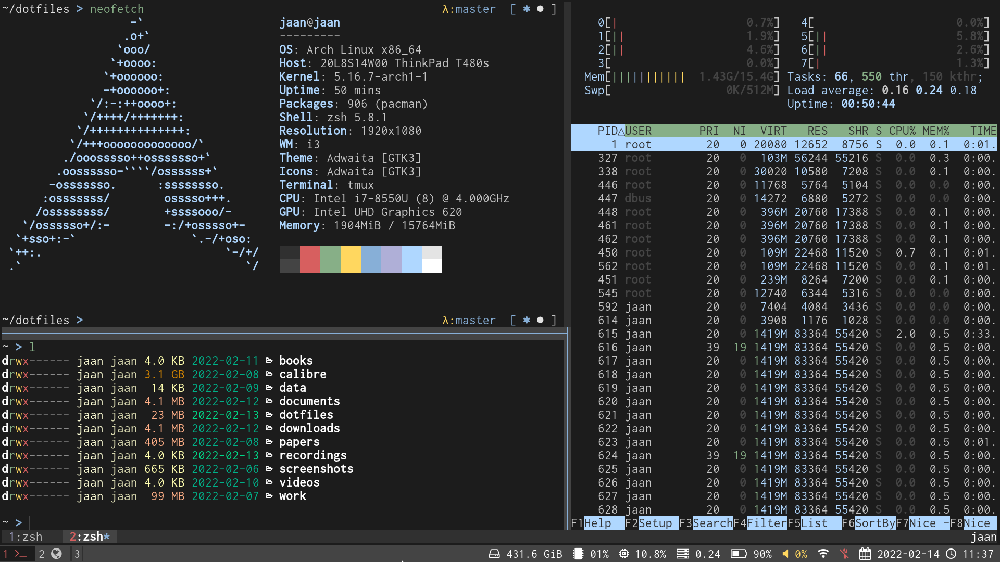

# Dotfiles



## About
My installation and configuration scripts and files for [Arch Linux](https://archlinux.org/). They are largely influenced by [Matthieu Cneude](https://github.com/Phantas0s) and his book [Building your Mouseless Development Environment](https://themouseless.dev/). If you are interested in building similar configuration, I recommend to read his book first!


## Philosophy
My configuration philosophy is to strive for effective, ergonomic and composable configuration by avoiding skeuomorphic design and accepting that such configuration requires effort to learn. It is inspired by the [Unix Philosophy](https://en.wikipedia.org/wiki/Unix_philosophy). Here are the main principles:

- **Keyboard over Mouse**: We should be able to use our configuration effectively without leaving the keyboard.

- **Command-line Driven**: We should primarily use programs via a command-line shell and master the built-in software tools. Command-Line Clients (CLIs) are simpler, more composable and more effective than Graphical User Interfaces (GUIs) for most tasks.

- **Shell Scripting**: We should create shell scripts for repetitive or complex tasks. We should link the scripts to a single location and make them available throughout the system similar to built-in commands.

- **Search over Navigation**: We should use search whenever possible instead of having to navigate through menus.

- **Text over Binary**: We should use text files over binary. Text files are simple, searchable and changes to them can be managed using version control.

- **Modular Configuration**: Modularity makes it easier to change components and reason about dependencies.

- **Information Security is Critical**: Your data could get lost, be stolen or hacked unless you protect it with encryption and backups.


## Arch Linux Setup
Here is a brief overview of the setup and configurations. 

[Key Bindings](./docs/key-bindings.md): VIM like key bindings

[Style](./docs/style.md): 

- Font: *Inconsolata* [*Nerd Font*](https://www.nerdfonts.com/) 
- Theme: Dark, minimalistic theme.

Desktop:

- Window system: [*X11*](https://www.x.org/)
- Tiling window manager: [*i3*](https://i3wm.org/)
- Application launcher: [*Rofi*](https://github.com/davatorium/rofi)
- Notifications: [*Dunst*](https://dunst-project.org/)
- Audio: *PulseAudio*
- Backlights: [*brightnessctl*](https://github.com/Hummer12007/brightnessctl)
- Bluetooth: [*bluez*](http://www.bluez.org/)
- Screenshot: [*maim*](https://github.com/naelstrof/maim)

Terminal:

- Emulator: [*rxvt-unicode*](https://wiki.archlinux.org/title/rxvt-unicode) with [*resize-font*](https://github.com/simmel/urxvt-resize-font) plugin
- Multiplexer: [*tmux*](https://github.com/tmux/tmux)
- Shell: [*Zsh*](https://wiki.archlinux.org/title/zsh)
- Editor: [*Neovim*](https://neovim.io/)
- Search tools: [*ripgrep*](https://github.com/BurntSushi/ripgrep), [*ripgrep-all*](https://github.com/phiresky/ripgrep-all)
- Fuzzy finder: [*fzf*](https://github.com/junegunn/fzf)
- Improved ls: [*lsd*](https://github.com/Peltoche/lsd)

Document viewer: [*Zathura*](https://pwmt.org/projects/zathura/)


## Hardware Setup
List of the hardware I am using with my setup.

- Laptop: *Lenovo Thinkpad T480s*
- Keyboard: [*Kinesis Advantage 2*](https://kinesis-ergo.com/keyboards/advantage2-keyboard/)
- Mouse: *Razer DeathAdder Elite*


## Installation Scripts
### Arch Linux
You can read my instructions for installing Arch Linux in the [`arch`](./arch) directory. It includes instructions with and without encryption and the post installation steps.

### Configurations 
First, we need to clone the dotfiles repository to the home directory. 

```bash
git clone git@github.com:jaantollander/dotfiles.git $HOME
```

Next, let's define the location of the dotfiles as an environment variable.

```bash
export DOTFILES=$HOME/dotfiles
```

Let's install Yay as an helper for installing packages from the Arch User Repository (AUR).

```bash
bash $DOTFILES/yay/install.sh
```

Next, install all packages.

```bash
bash $DOTFILES/install_packages.sh
```

Finally, install all configs.

```bash
bash $DOTFILES/install_configs.sh
```


## Resources
Here is a list of some useful resources for developing dotfiles.

- [ArchWiki](https://wiki.archlinux.org/) is the official resource for everything related to Arch Linux.

- *Matthieu Cneude* also has great [articles](https://thevaluable.dev/) on his website and his [dotfiles](https://github.com/Phantas0s/.dotfiles) are also useful. 

- An excellent [Bash scripting cheatsheet](https://devhints.io/bash) from *devhints*.

- [Efficient UEFI Encrypted Root and Swap Arch Linux Installation Procedure with an Encrypted Boot](https://gist.github.com/HardenedArray/ee3041c04165926fca02deca675effe1) by *HardenedArray*

- *Maxim Baz* has [dotfiles](https://github.com/maximbaz/dotfiles) for Arch Linux with Wayland, Kitty and Kakoune.
