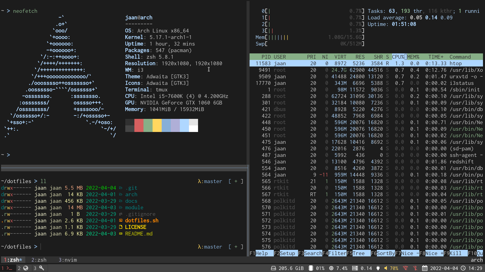

# Dotfiles



## About
This repository contains my files and scripts for installing [Arch Linux](https://archlinux.org/) and configuring various software tools.

I began the journey to build a custom configuration by reading the book [**Building your Mouseless Development Environment**](https://themouseless.dev/) by [Matthieu Cneude](https://github.com/Phantas0s). So if you are interested in building your configuration, I recommend reading his book first! The contents of this repository will make much more sense afterward.

Furthermore, I recommend reading first the [**Linux Pocket Guide**](https://linuxpocketguide.com/) and then [**Efficient Linux at the Command Line**](https://efficientlinux.com/) by *Daniel J. Barret*. His books give a concise guide to the essential Linux commands and how to use the command line effectively. Knowing these Linux commands and how to use the command line is fundamental for the configuration presented in this repository. 


## Philosophy
My configuration philosophy is to strive for a minimal, ergonomic, and composable configuration by avoiding skeuomorphic design and accepting that such configuration requires effort to learn. It builds upon the [Unix Philosophy](https://en.wikipedia.org/wiki/Unix_philosophy). Here are the main principles:

- **Keyboard Driven**: We should be able to use our configuration effectively without leaving the keyboard and use the mouse only for graphical tasks.

- **Command-line Driven**: We should primarily use programs via Command-Line Interfaces on a command-line shell. Command-Line Clients (CLIs) are a simple, effective, and composable way to interact with programs compared to Graphical User Interfaces (GUIs).

- **Use Built-in Software Tools and Avoid Unnecessary Dependencies**: We should aim to use the built-in software tools and operating system features and install additional software only if necessary.

- **Shell Scripting**: We should create shell scripts for repetitive or complex tasks. We should link the scripts to a single location and make them available throughout the system, similar to built-in commands.

- **Search over Navigation**: We should use search whenever possible instead of navigating through menus.

- **Text over Binary**: We should use text files over binary. Text files are simple, universal, and searchable, and we can track changes to text files using version control.

- **Modular Configuration**: Modularity makes it easier to change components and reason about dependencies.

- **Information Security is Essential**: Your data could get lost, be stolen, or hacked unless you protect it with encryption and backups.


## Arch Linux Setup
Here is an overview of the setup and configurations. 

System:

- Encrypted root and swap filesystems with an encrypted boot and boot from UEFI. Decrypts and mounts the entire encrypted system using a single LUKS passphrase entry. [Instructions by HardenedArray](https://gist.github.com/HardenedArray/ee3041c04165926fca02deca675effe1)
- System and service manager: [systemd](https://systemd.io/)

Key Bindings: 

- VIM like key bindings

Style: 

- Font: *Inconsolata* [*Nerd Font*](https://www.nerdfonts.com/) 
- Theme: Dark, minimalistic theme.

Desktop:

- Window system: [*xorg*](https://www.x.org/)
- Tiling window manager: [*i3*](https://i3wm.org/)
- Application launcher: [*Rofi*](https://github.com/davatorium/rofi)
- Notifications: [*Dunst*](https://dunst-project.org/)
- Audio: *PulseAudio*
- Backlights: [*brightnessctl*](https://github.com/Hummer12007/brightnessctl)
- Bluetooth: [*bluez*](http://www.bluez.org/)
- Screenshot: [*maim*](https://github.com/naelstrof/maim)

Terminal:

- Emulator: [*rxvt-unicode*](https://wiki.archlinux.org/title/rxvt-unicode) with [*resize-font*](https://github.com/simmel/urxvt-resize-font) plugin
- Multiplexer: [*tmux*](https://github.com/tmux/tmux)
- Shell: [*Zsh*](https://wiki.archlinux.org/title/zsh)
- Editor: [*Neovim*](https://neovim.io/) with [*Vim Plug*](https://github.com/junegunn/vim-plug) plugin manager

Command-line utilities: 

- [*Core Utilities*](https://wiki.archlinux.org/title/Core_utilities)
- Version Control: [*Git*](https://git-scm.com/)
- File transfer and backup: [*rsync*](https://rsync.samba.org/)
- Search tools: [*ripgrep*](https://github.com/BurntSushi/ripgrep), [*ripgrep-all*](https://github.com/phiresky/ripgrep-all)
- Fuzzy finder: [*fzf*](https://github.com/junegunn/fzf)
- Improved ls and coloring: [*lsd*](https://github.com/Peltoche/lsd) and [*LS_COLORS*](https://github.com/trapd00r/LS_COLORS)
- Improved cat: [*bat*](https://github.com/sharkdp/bat)
- Simplified help pages: [*tldr*](https://tldr.sh/)

Other tools:

- Process Viewer: [*htop*](https://htop.dev/)
- Password manager: [*KeePassXC*](https://keepassxc.org)
- Document viewer: [*mupdf*](https://mupdf.com/), [*Zathura*](https://pwmt.org/projects/zathura/)
- Plain text accounting: [*hledger*](https://hledger.org/)
- Hosting Git repositories: [*GitHub CLI*](https://cli.github.com/)


## Hardware Setup
List of the hardware I am using with my setup.

- Laptop: *Lenovo Thinkpad T480s*
- Keyboard: [*Kinesis Advantage 2*](https://kinesis-ergo.com/keyboards/advantage2-keyboard/)
- Mouse: *Razer DeathAdder Elite*
- USB Flash Drive: *Kingston DataTraveler*


## Installation Scripts
### Arch Linux
You can read my instructions for installing Arch Linux in the [**arch**](./arch) directory. It includes instructions with and without encryption and the post-installation steps.

### Configurations 
First, let's install Git if we haven't already.

```bash
sudo pacman -S git
```

Then, we can clone the dotfiles repository to the home directory. 

```bash
git clone git@github.com:jaantollander/dotfiles.git $HOME
```

Next, let's change working directory to dotfiles.

```bash
cd $HOME/dotfiles
```

Let's install Yay as a helper for installing packages from the Arch User Repository (AUR).

```bash
./dotfiles.sh install yay
```

Next, install packages for the target module.

```bash
./dotfiles.sh packages "thinkpad_t480s"
```

Finally, install configs for the target module.

```bash
./dotfiles.sh config "thinkpad_t480s"
```


## Documentation
The [**documentation**](./docs) contains a more detailed configuration overview.

- [Modules](./docs/modules.md)
- [Key Bindings](./docs/key-bindings.md)
- [Style](./docs/style.md)
- [Shell](./docs/shell.md)


## Resources
Here is a list of some helpful resources for developing dotfiles.

- [ArchWiki](https://wiki.archlinux.org/) is the official resource for everything related to Arch Linux.

- *Matthieu Cneude* also has great [articles](https://thevaluable.dev/) on his website and his [dotfiles](https://github.com/Phantas0s/.dotfiles) are also useful. 

- *Maxim Baz* has useful [dotfiles](https://github.com/maximbaz/dotfiles) for Arch Linux.

- An excellent [Bash scripting cheatsheet](https://devhints.io/bash) from *devhints*.

- The [Command Line Interface Guidelines](https://clig.dev/) is an excellent resource for writing command-line interfaces.

- We can use [Argbash](https://argbash.io/) for adding command-line arguments to Bash scripts.

- The [xsh](https://github.com/sgleizes/xsh) framework provides conventions for managing shell configuration consistently.

- *Dylanaraps* has written the [pure bash bible](https://github.com/dylanaraps/pure-bash-bible), [pure sh bible](https://github.com/dylanaraps/pure-sh-bible), and [how to write TUI in Bash](https://github.com/dylanaraps/writing-a-tui-in-bash) which are excellent resources for writing better bash and posix shell scripts. He has also written many other interesting projects using shell scripting such as [neofetch](https://github.com/dylanaraps/neofetch), [pfetch](https://github.com/dylanaraps/pfetch), [fff](https://github.com/dylanaraps/fff), [pash](https://github.com/dylanaraps/pash), [torque](https://github.com/dylanaraps/torque), and [shfm](https://github.com/dylanaraps/shfm/)!

- [ShellCheck](https://github.com/koalaman/shellcheck) is a static analysis tool for shell scripts.
